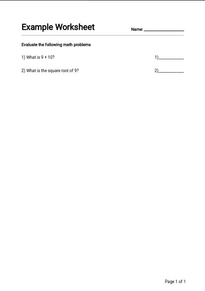

# worksheetgen
A worksheet generator

## Installation
You can install worksheetgen via pip:
`pip install worksheetgen`

## Basic Usage
```python
# Instantiates the worksheet object and titles it
ws = Worksheet(title='Example Worksheet')

# Add sections
with ws.section('Section 1'):
    ws.add_problem('What is 9 + 10?') # No answer provided

    # Note that the raw string literal r'' is needed so that
    # the backslashes are not escaped
    ws.add_problem(r'What is the value of \( \sqrt{9} \) ?', 3) # Answer provided

# Note that the numbering is restarted for each section
with ws.section('Section 2', description="This is a description to section 2"):
    # The following problem, '\tan' will be escaped into 'tab an' if not for the r''
    ws.add_problem(r'What is the value of \( \tan(45^0) \)', whitespace_after=True) # Add whitespace
    ws.add_problem(r'\( f(x)=3x-5,\; f(2)=? \)')

# Instruction-class can also be used for general texts, I suppose?
ws.add_instruction("That's for the worksheet!")

# Write PDF with filename
ws.write_pdf('ws.pdf')
```
This produces the following pdf:


